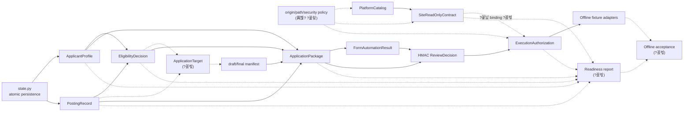

## 寃곕줎

?꾩옱 ?€?μ냼??濡쒖뺄 湲곕컲 湲곕뒫???곷떦???꾩꽦?먯?留? 紐⑺몴 ?꾩껜瑜??쐏roduction-quality local foundation ?꾨즺?앸줈 ?먯젙?섍린?먮뒗 ?꾩쭅 ?대쫭?덈떎.

- ?꾩옱 釉뚮옖移? `codex/phase6-5-site-intake-readonly`
- ?꾩껜 寃€利? `403 passed, 2 skipped`
- Phase 6.5 愿€??寃€利? `88 passed, 1 skipped`
- `compileall`, `git diff --check`: ?듦낵
- ?ㅼ젣 釉뚮씪?곗? ?ㅽ뻾쨌?댁쁺 ?ъ씠??mutation CLI: ?놁쓬
- ?듭떖 誘몄셿猷? Phase 6.5 fail-closed 蹂닿컯, `ApplicationTarget`, site contract?€ authorization 寃고빀, ?꾩껜 readiness 紐낅졊, ???④퀎 offline acceptance, ?꾩뿭 atomic write/path confinement

?뱁엳 ?꾩옱 Phase 6.5???뚯뒪?몃뒗 ?듦낵?섏?留??ㅼ쓬 臾몄젣 ?뚮Ц??洹몃?濡?checkpoint?섎㈃ ???⑸땲??

1. `login/mfa/captcha/iframe`媛€ `unknown`?댁뼱???ㅻⅨ 議곌굔留?留욎쑝硫?`read_only_contract_ready`媛€ ?????덉뒿?덈떎. ?쐕nknown ??manual_review???쒖빟怨?異⑸룎?⑸땲?? [site_intake.py](<workspace>/career_pipeline/site_intake.py:296)
2. `intake_id`媛€ 援ъ“ ?뺤씤 寃곌낵?€ validation code瑜??ы븿?섏? ?딆뒿?덈떎. ?숈씪 fixture???€???ш???寃곌낵媛€ ?щ씪?몃룄 湲곗〈 record媛€ 洹몃?濡?諛섑솚?????덉뒿?덈떎. [site_intake.py](<workspace>/career_pipeline/site_intake.py:309)
3. `authorize_execution()`?€ ?꾩쭅 寃€?좊맂 site-intake contract??臾띠씠吏€ ?딄퀬 ?꾩쓽???좏슚??exact HTTPS origin?쇰줈 authorization??留뚮뱾 ???덉뒿?덈떎. [application_execution.py](<workspace>/career_pipeline/application_execution.py:97)
4. ?ㅺ퀎??紐낆떆??`ApplicationTarget` 紐⑤뜽쨌?€??怨꾩빟???놁뒿?덈떎.
5. ???④퀎???곹깭瑜?醫낇빀?섎뒗 production readiness 紐낅졊怨?acceptance test媛€ ?놁뒿?덈떎.

## ?명꽣?섏씠???섏〈??洹몃옒??


?꾩옱 `platform_catalog.py ??application_execution.normalize_origin` ?섏〈?깆씠 ?덉뒿?덈떎. ?욎쑝濡?`application_execution ??site_intake`瑜?吏곸젒 異붽??섎㈃ ?ㅼ쓬 ?쒗솚??諛쒖깮?⑸땲??

```text
application_execution
??site_intake
??platform_catalog
??application_execution
```

?곕씪??origin 寃€利앹? ?낅┰?곸씤 `origin_policy.py` 媛숈? ?섏쐞 紐⑤뱢濡?癒쇱? 遺꾨━?댁빞 ?⑸땲??

## Milestone DAG

```mermaid
flowchart TD
    M0["M0 Phase 6.5 蹂닿컯쨌checkpoint<br/>unknown fail-closed, intake identity, registry validation"]
    M1["M1 ?꾩껜 ?붽뎄?ы빆 trace audit<br/>?꾨즺쨌?꾨씫쨌?몃? ?꾩슜 遺꾨쪟"]
    M2A["M2A 怨듯넻 ?덉쟾 湲곕컲<br/>origin/path policy, atomic text writes"]
    M2B["M2B ApplicationTarget 怨꾩빟<br/>schema, validation, persistence"]
    M2C["M2C private-data provider 怨꾩빟<br/>plaintext live readiness 李⑤떒"]
    M3A["M3A Site contract-bound authorization<br/>origin/schema/path/contract SHA binding"]
    M3B["M3B Operational readiness model<br/>local_complete vs external_blocked"]
    M3C["M3C 蹂댁븞 ?ㅼ틪쨌repo hygiene<br/>?덈? ?ъ슜??寃쎈줈쨌誘쇨컧?뺣낫 寃€??]
    M4["M4 CLI ?듯빀<br/>target/status/readiness/acceptance"]
    M5["M5 Offline end-to-end acceptance<br/>posting?뭦rofile?뭙ligibility?뭦ackage?뭝ntake?뭓uth readiness"]
    M6["M6 臾몄꽌쨌?꾩껜 寃€利씲톍lean checkpoints"]

    M0 --> M1
    M1 --> M2A
    M1 --> M2B
    M1 --> M2C
    M2A --> M3A
    M2B --> M3A
    M2C --> M3A
    M2A --> M3B
    M2B --> M3B
    M3C --> M3B
    M3A --> M4
    M3B --> M4
    M4 --> M5
    M5 --> M6
    M3C --> M6
```

### 留덉씪?ㅽ넠蹂??꾨즺 議곌굔

- M0: 紐⑤뱺 誘명솗??援ъ“ 媛믪씠 `manual_review_required`; ?ш????곹깭媛€ registry?먯꽌 援щ퀎?? catalog-derived platform status; Phase 6.5 ?뚯뒪?맞룸Ц???듦낵.
- M1: ?붽뎄?ы빆蹂?`implemented / locally_missing / external_only` ?쒓? ?앹꽦??
- M2A: 紐⑤뱺 ?꾨줈?앺듃 ?곗텧臾??곌린媛€ atomic helper瑜??ъ슜?섍퀬, CLI 異쒕젰쨌resume 寃쎈줈媛€ workspace confinement瑜??곕쫫.
- M2B: `ApplicationTarget`??posting/profile/eligibility/question/final manifest SHA瑜?臾띠쓬.
- M2C: ?ㅼ젣 private data??provider reference濡쒕쭔 ?ъ슜?섍퀬, 蹂댄샇 provider媛€ ?놁쑝硫?live readiness媛€ fail-closed.
- M3A: authorization??`site_contract_id`, exact origin, allowed path, fixture/schema SHA, `mutation_enabled`, `live_enabled`??寃고빀??
- M3B: ?쒕줈而?湲곕컲 ?꾨즺?앹? ?쒖떎?ъ씠???낅젰 遺€議기€앹쓣 蹂꾨룄 ?꾨뱶濡?異쒕젰.
- M5: ?몃? ?ㅽ듃?뚰겕쨌釉뚮씪?곗?쨌?ㅼ젣 PII ?놁씠 ?꾩껜 ?먮쫫????踰덉뿉 寃€利?
- M6: `pytest`, `compileall`, `diff --check`, CLI acceptance, 蹂댁븞 ?ㅼ틪, clean git ?곹깭.

## ?뚯씪 異⑸룎 留ㅽ듃由?뒪

`H`???숈씪 ?뚯씪쨌?숈씪 ?명꽣?섏씠?ㅻ? ?섏젙??媛€?μ꽦???믩떎???살엯?덈떎.

| ?뚯씪 | M0 | M2A | M2B | M2C | M3A | M3B/M4 | M5/M6 | 異⑸룎 ?먮떒 |
|---|:---:|:---:|:---:|:---:|:---:|:---:|:---:|---|
| [__main__.py](<workspace>/career_pipeline/__main__.py:104) | H | H | M | M | H | H | H | ?⑥씪 integration owner ?꾩슂 |
| [site_intake.py](<workspace>/career_pipeline/site_intake.py:271) | H | M | ??| ??| H | M | M | M0 ?꾨즺 ??M3A 湲덉? |
| [platform_catalog.py](<workspace>/career_pipeline/platform_catalog.py:10) | H | H | ??| ??| M | M | L | origin 遺꾨━?€ 異⑸룎 |
| [application_execution.py](<workspace>/career_pipeline/application_execution.py:48) | ??| M | ??| ??| H | M | M | authorization contract 以묒떖 |
| [application_package.py](<workspace>/career_pipeline/application_package.py:155) | ??| H | M | H | H | M | M | path/private/target 蹂€寃?以묒꺽 |
| [models.py](<workspace>/career_pipeline/models.py:132) | ??| ??| H | M | M | M | L | schema 蹂€寃쎌? 癒쇱? ?숆껐 |
| [state.py](<workspace>/career_pipeline/state.py:29) | ??| H | L | L | M | M | M | atomic API ?좏뻾 ?꾩슂 |
| [orchestrator.py](<workspace>/career_pipeline/orchestrator.py:315) | ??| H | M | ??| ??| M | H | atomic migration怨?acceptance 異⑸룎 |
| `career_pipeline/readiness.py` ?좉퇋 | ??| L | M | M | M | H | H | ?낅┰ 援ы쁽 媛€??|
| `career_pipeline/application_target.py` ?좉퇋 | ??| L | H | ??| M | M | M | `models.py` 蹂€寃?理쒖냼??媛€??|
| `career_pipeline/origin_policy.py` ?좉퇋 | ??| H | ??| ??| H | L | L | 媛€??癒쇱? ?명꽣?섏씠??怨좎젙 |
| `tests/test_cli.py` | H | M | M | M | H | H | H | 留덉?留??듯빀 ?대떦?먮쭔 ?섏젙 沅뚯옣 |
| `tests/test_site_intake.py` | H | M | ??| ??| H | L | M | M0/M3A ?쒖감 吏꾪뻾 |
| `tests/test_application_execution.py` | ??| M | ??| ??| H | M | H | authorization 蹂€寃쎄낵 ?숈떆 ?몄쭛 湲덉? |
| `tests/test_offline_acceptance.py` ?좉퇋 | ??| ??| M | M | M | M | H | ?명꽣?섏씠???숆껐 ???묒꽦 |
| `docs/career-pipeline-usage.md` | H | M | M | M | H | H | H | 理쒖쥌 臾몄꽌 owner ??紐?|
| `docs/superpowers/plans/*` | ??| ??| ??| ??| ??| M | H | ?ъ슜???덈? 寃쎈줈 ?뺣━ ?꾩슂 |

## 蹂묐젹 洹몃９

### Parallel Group 0 ??利됱떆

- ?묒뾽 A: M0 Phase 6.5 肄붾뱶 蹂닿컯
- ?묒뾽 B: read-only ?붽뎄?ы빆 trace audit
- ?묒뾽 C: 湲곗〈 persistence/path/PII ?꾨컲 紐⑸줉 ?묒꽦

B?€ C???뚯씪???섏젙?섏? ?딅뒗 議곌굔?쇰줈 A?€ 蹂묐젹?뷀븷 ???덉뒿?덈떎.

### Parallel Group 1 ??M0 checkpoint ?댄썑

- ?묒뾽 A: `origin_policy.py`, `path_policy.py`, atomic text helper
- ?묒뾽 B: `ApplicationTarget` schema쨌validator쨌persistence
- ?묒뾽 C: `private_data_provider` protocol怨?fail-closed readiness
- ?묒뾽 D: repository security scanner?€ 湲곗〈 臾몄꽌 寃쎈줈 ?뺣━

媛??묒뾽?€ ??紐⑤뱢怨??꾩슜 ?뚯뒪?몃? ?곗꽑 ?ъ슜?섍퀬 `__main__.py` ?섏젙?€ 誘몃쨪???⑸땲??

### Parallel Group 2 ??怨듯넻 ?명꽣?섏씠???숆껐 ?댄썑

- ?묒뾽 A: site contract-bound authorization
- ?묒뾽 B: readiness aggregation domain logic
- ?묒뾽 C: synthetic offline acceptance fixture/scenario ?묒꽦
- ?묒뾽 D: 臾몄꽌 珥덉븞怨??몃? blocker catalog

A?€ B???쎈뒗 ?곹깭 怨꾩빟??癒쇱? ?⑹쓽?섎㈃ 蹂묐젹 媛€?ν빀?덈떎. CLI ?곌껐?€ 蹂묐젹?뷀븯吏€ ?딅뒗 ?몄씠 ?덉쟾?⑸땲??

### Serialized Integration Group

?ㅼ쓬 ?뚯씪?€ ???대떦?먭? ?쒖꽌?€濡??듯빀?댁빞 ?⑸땲??

1. `career_pipeline/__main__.py`
2. `tests/test_cli.py`
3. `docs/career-pipeline-usage.md`
4. `.agents/skills/career-pipeline/SKILL.md`
5. full acceptance 諛?理쒖쥌 security scan

## 怨듭쑀 ?곹깭?€ ?숈떆???꾪뿕

| 怨듭쑀 ?곹깭 | ?꾩옱 writer | 蹂댄샇 諛⑹떇 | ?꾪뿕 |
|---|---|---|---|
| `.career_profile/experience_ledger.json` | profile confirm/refresh | ?쇨???怨듯넻 lock ?놁쓬 | profile怨?package ?ъ씠 TOCTOU |
| `.career_profile/posting_registry/registry.json` | discovery/registry | registry lock쨌atomic JSON | readiness 以?蹂€寃?媛€??|
| `.career_profile/application_registry.json` | application package | 蹂꾨룄 lock | site/execution registry?€ transaction ?놁쓬 |
| `.career_profile/site_intake/registry.json` | site intake | version + lock | intake identity媛€ 寃€???곹깭瑜??ы븿?섏? ?딆쓬 |
| `.career_profile/execution-ledger.json` | authorization/execution | HMAC + lock | site contract binding ?놁쓬 |
| `career_runs/*/run.json` | orchestrator/state | atomic JSON | 愿€??Markdown/Docx??蹂꾨룄 non-atomic write |
| `CAREER_EXECUTION_SIGNING_KEY` | ?몃? ?섍꼍 | repo 鍮꾩???| ?녾굅??吏㏃쑝硫?fail-closed |
| `CAREER_MODEL_*` | ?몃? ?섍꼍 | ?좏깮??| deterministic offline acceptance?먯꽌??鍮꾪솢?깊솕 ?꾩슂 |

?щ윭 registry瑜?臾띕뒗 ?꾩뿭 transaction?€ ?꾩슂?섏? ?딆?留? readiness 寃곌낵?먮뒗 媛?artifact??SHA/version??湲곕줉?댁빞 ?⑸땲?? ?곹깭媛€ ?꾩쨷??諛붾€뚮㈃ ?ㅼ떆 怨꾩궛?섎룄濡??댁빞 ?⑸땲??

## ?몃? ?섏〈??
### ?대? ?좎뼵??濡쒖뺄 ?섏〈??
| ??ぉ | ?⑸룄 | ?곹깭 |
|---|---|---|
| Python `>=3.11` | ?ㅽ뻾 ?섍꼍 | ?꾩옱 3.12 |
| `setuptools>=69` | build backend | ?좎뼵??|
| `python-docx` | DOCX ?쎄린쨌?앹꽦 | ?좎뼵??|
| `pypdf` | PDF ?쎄린 | ?좎뼵??|
| `openpyxl` | XLSX ?쎄린 | ?좎뼵??|
| `PyYAML` | YAML | ?좎뼵??|
| `pytest>=8` | ?뚯뒪??| dev optional |
| `python -m build` | package build 寃€利?| ?꾩옱 紐⑤뱢 誘몄꽕移? ?깃났 湲곗????꾩닔 寃€利앹? ?꾨떂 |

??production dependency???꾩옱 遺꾩꽍???꾩슂?섏? ?딆뒿?덈떎.

### ?고????몃? ?낅젰

| ?몃? ?낅젰 | 濡쒖뺄?먯꽌 媛€?ν븳 泥섎━ | live readiness |
|---|---|---|
| 怨듭떇 怨듦퀬 URL/蹂몃Ц | 怨듭떇 ?뚯씪 ?먮뒗 ?뱀씤??source contract 遺꾩꽍 | ?ㅼ젣 理쒖떊?깆? ?몃? ?뺤씤 ?꾩슂 |
| 湲곗뾽蹂?exact application URL | URL쨌origin 寃€利?媛€??| ?ъ슜?먭? ?ㅼ젣 URL???쒓났?댁빞 ??|
| 鍮꾩떇蹂?HTML fixture | read-only schema/contract ?앹꽦 媛€??| ?ㅼ젣 DOM ?쇱튂 ?щ????몃? ?뺤씤 ?꾩슂 |
| HMAC secret | ?섍꼍蹂€?섎줈 二쇱엯 媛€??| ?몃? secret ?놁쑝硫?authorization 李⑤떒 |
| 濡쒓렇??怨꾩젙쨌MFA쨌CAPTCHA | 怨꾩빟??blocker濡?湲곕줉 | ?먮룞??湲덉? |
| ?ㅼ젣 媛쒖씤?뺣낫 | provider reference쨌hash 寃€利?媛€??| 紐낆떆??authority ?꾩뿉???꾩넚 湲덉? |
| 泥⑤??뚯씪 | hash쨌format contract 寃€利?媛€??| ?ㅼ젣 ?낅줈??湲덉? |
| ?ъ씠???쎄?쨌automation ?덉슜 ?щ? | readiness blocker濡?湲곕줉 | ?щ엺 寃€???꾩슂 |
| ?댁쁺 browser/Playwright | fixture protocol留??뚯뒪??媛€??| ?ㅼ튂쨌?ㅽ뻾쨌?ъ씠???묒냽 湲덉? |

### 諛섎뱶???몃? ?꾩슜 blocker濡??④꺼???섎뒗 ??ぉ

- ?ㅼ젣 湲곗뾽 application origin ?뺤씤
- ?댁쁺 DOM 諛??ㅻ떒怨??먮쫫 ?뺤씤
- 濡쒓렇?맞텺FA쨌CAPTCHA ?곹깭
- ?ъ씠???먮룞???쎄? 寃€??- ?ㅼ젣 怨꾩젙/?먭꺽 諛?媛쒖씤?뺣낫 ?꾩넚 沅뚰븳
- 泥⑤??뚯씪 ?낅줈??- click/submit 諛??묒닔踰덊샇 ?뺤씤
- ?댁쁺 ?ъ씠??completion evidence

????ぉ?ㅼ? 援ы쁽 誘몄셿猷뚮줈 ?쒖떆?섍린蹂대떎 `external_input_required` ?먮뒗 `live_blocked`濡?蹂닿퀬?댁빞 ?⑸땲??

## 異붽? 媛먯궗 ?ъ씤??
- ?ㅼ닔??Markdown쨌JSON 異쒕젰???꾩쭅 `write_text()`瑜?吏곸젒 ?ъ슜?섏뿬 ?꾩뿭 atomic-write ?쒖빟??異⑹”?섏? ?딆뒿?덈떎.
- ?쇰? profile/posting CLI 異쒕젰怨?`resume` 寃쎈줈??workspace confinement瑜?怨듯넻 ?곸슜?섏? ?딆뒿?덈떎.
- private data??gitignored `.career_profile`???쇰컲 JSON?쇰줈 ?쎌뒿?덈떎. 濡쒖뺄 fixture?먮뒗 ?ъ슜?????덉?留?production readiness?먮뒗 蹂댄샇 provider媛€ ?녿떎??blocker媛€ ?꾩슂?⑸땲??
- 怨쇨굅 ?ㅺ퀎 臾몄꽌??`C:\Users\...` ?뺥깭???덈? ?ъ슜??寃쎈줈媛€ ?⑥븘 ?덉뒿?덈떎. 理쒖쥌 security hygiene?먯꽌 placeholder濡?諛붽퓭???⑸땲??
- 湲곗〈 `test_v2_end_to_end.py`??drafting/finalization 寃쎈줈留?寃€利앺븯硫?package/intake/authorization readiness源뚯? ?댁뼱吏€吏€ ?딆뒿?덈떎.

?곕씪??媛€???덉쟾???ㅽ뻾 ?쒖꽌??**Phase 6.5 蹂닿컯 checkpoint ??怨듯넻 ?덉쟾 ?뺤콉 諛?`ApplicationTarget` ??contract-bound authorization/readiness ??offline acceptance ??臾몄꽌쨌蹂댁븞쨌?꾩껜 寃€利?*?낅땲??

<oai-mem-citation>
<citation_entries>
MEMORY.md:50-53|note=[confirmed ledger gate and distinction between green tests and operational readiness]
</citation_entries>
<rollout_ids>
019f4903-a48e-7bf2-bea7-4246f8c7e439
019f4908-5f29-74e1-af6b-9fee46855854
</rollout_ids>
</oai-mem-citation>
