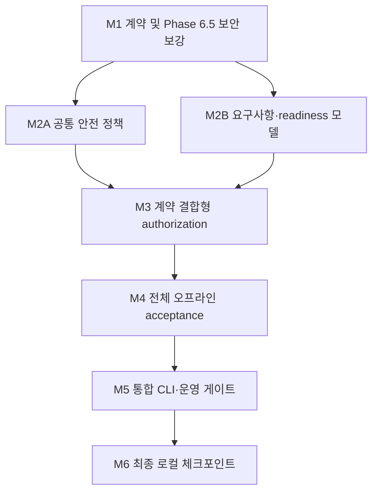

## Conflict Resolution Log

| 쟁점 | 리뷰어 간 판단 | 최종 결정과 근거 |
|---|---|---|
| Phase 6.5 상태 | 일부는 미커밋, 일부는 `809929c` 커밋·clean으로 판단 | 사용자 지시를 기준으로 `809929c`를 확정 기준선으로 취급한다. 이후 작업은 “Phase 6.5 완성”이 아니라 보안 결함을 고치는 corrective hardening이다. |
| 최우선 작업 | 사용자 가치 분석은 acceptance/readiness를 우선하고, 아키텍처·위험 분석은 fail-closed 결함을 우선 | hardening을 먼저 수행한다. 현재 site contract가 불완전한 상태에서 acceptance를 만들면 잘못된 준비 상태를 공식 경로로 굳힐 수 있다. 단, readiness schema 설계는 hardening과 함께 동결한다. |
| `read_only_contract_ready` 의미 | 현재 정적 fixture 분석 성공과 로컬 안전성 증명이 혼용됨 | 상태를 분리한다: `fixture_parsed`, `contract_candidate`, `locally_verified`, `manual_review_required`, `external_input_required`, `live_execution_disabled`. 정적 HTML 분석은 live 안전성을 증명하지 않는다. |
| Authorization 범위 | 기존 HMAC·exact-origin 검증은 강하지만 site-intake와 분리됨 | authorization v2를 site contract ID/SHA, adapter ID, exact origin, canonical schema SHA, package SHA에 결합한다. `live_enabled=false` 또는 `mutation_enabled=false`이면 실행 계층에서도 mutation을 차단한다. |
| `submit` 지원 여부 | 코어와 문서에는 submit 경로가 있지만 live adapter/CLI는 없음 | 현재 readiness에서 `submit_supported`나 `live_ready`로 표시하지 않는다. 기존 구문은 호환을 위해 읽을 수 있어도 권한 발급·실행은 fail-closed 처리한다. |
| Schema digest 통합 방식 | 단일 canonical schema로 전면 통합하거나 계층별 digest lineage를 유지하는 방안이 제시됨 | versioned canonical form contract를 정의하고, 기존 digest는 변환 lineage로 보존한다. 즉시 전면 마이그레이션해 기존 artifact를 깨뜨리지 않는다. |
| `ApplicationTarget` 도입 | 의존성 분석은 필수 누락으로 판단했지만 다른 리뷰는 명시적으로 요구하지 않음 | 독립 마일스톤으로 먼저 만들지 않는다. 요구사항 추적에서 posting/profile/eligibility/final manifest 결합이 실제로 누락됐음이 확인되면 최소 모델로 도입한다. 단순 acceptance 조립만을 위한 추상화 추가는 피한다. |
| Private-data provider | 보호 provider가 필요하다는 제안과 합성 데이터만으로 acceptance가 가능하다는 판단이 공존 | 이번 범위에서는 실제 PII를 전혀 사용하지 않는다. provider는 readiness의 외부 blocker 계약으로만 정의하며, 구현은 요구사항 감사에서 실제 로컬 공백으로 확인될 때만 수행한다. |
| 저장소 절대 경로 기준 | 저장소 전체 정리와 배포 표면만 정리하는 두 해석이 충돌 | 스캔 범위를 `career_pipeline/`, 배포 패키지에 포함되는 문서, 테스트 fixture 및 생성된 acceptance 결과로 고정한다. 개인 취업자료와 과거 작업 산출물은 삭제·이동하지 않는다. 추적되는 제품 문서의 사용자 절대 경로는 placeholder로 교체한다. |
| 전역 persistence 개편 | 모든 write를 즉시 공통화하자는 제안과 범위 팽창 우려가 충돌 | 권한·registry·acceptance·readiness 경로부터 공통 atomic/path/lock 정책을 적용한다. unrelated 역사적 출력 전체의 일괄 리팩터링은 하지 않는다. |
| 복구·키 회전 | production-quality에 필요하나 전체 key-management 시스템은 범위가 큼 | non-secret key ID, 서명 버전, legacy authorization 거부, orphan-lock 진단, read-only reconciliation까지 포함한다. 자동 lock 삭제와 외부 secret 저장은 제외한다. |
| 병렬화 | 새 모듈은 병렬 가능하지만 `__main__.py`, CLI 테스트, 사용 문서 충돌이 큼 | 도메인 작업은 파일 소유권을 분리해 병렬화하고, CLI·통합 테스트·문서는 한 integration owner가 직렬 처리한다. |
| 최종 완료 의미 | 테스트 통과와 실제 지원 준비가 혼동될 위험 | 완료는 “local foundation 및 offline acceptance 완료”까지만 의미한다. 실제 origin, credentials, 약관, 운영 DOM, 업로드, click/submit은 명시적인 external blocker로 남긴다. |

공통 합의는 다음과 같다.

- 현재 단위·부분 통합 테스트는 강하지만 전체 application 흐름을 증명하지 않는다.
- unknown/required 상태는 반드시 `manual_review_required`로 수렴해야 한다.
- site contract와 authorization의 결합이 핵심 보안 공백이다.
- readiness는 로컬 완성도와 외부/live 준비도를 분리해야 한다.
- 실제 사이트 접근과 mutation은 이번 범위에서 금지한다.
- 최종 결과는 machine-readable evidence와 재실행 가능한 오프라인 acceptance로 증명해야 한다.

## Milestone DAG

이 DAG에는 순환이 없다. M2A와 M2B만 병렬 실행하며 파일 소유권을 다음처럼 분리한다.

- M2A 소유: `origin_policy.py`, `path_policy.py`, `state.py` 및 전용 테스트
- M2B 소유: 신규 `readiness.py`, 요구사항 매트릭스와 전용 테스트
- 공용 충돌 파일인 `__main__.py`, `tests/test_cli.py`, 사용 문서는 M5까지 수정하지 않는다.
- `site_intake.py`는 M1, `application_execution.py`는 M3가 각각 단독 소유한다.
- M4 이후에는 단일 integration owner가 직렬로 작업한다.

### M1 — Phase 6.5 Fail-Closed Corrective Hardening

**Goal:** 기존 `809929c` 기준선을 유지하면서 site-intake가 모든 불명확하거나 위험한 구조를 보수적으로 차단하도록 계약 의미와 identity를 수정한다.

**Success Criteria:**

- `login`, MFA, CAPTCHA, iframe, popup, redirect, attachment 중 하나라도 `unknown` 또는 검토 필요 상태이면 `read_only_contract_ready=false`와 안정된 reason code가 기록된다.
- `base`, `formaction`, 중첩 form, malformed HTML, URL token 및 민감 fixture에 대한 adversarial 테스트가 mutation 없이 통과한다.
- intake identity 또는 contract digest가 validation 결과와 canonical schema lineage를 반영해 재검토 결과를 오래된 registry record로 대체하지 않는다.
- 기존 `mutation_enabled=false`, `live_enabled=false`가 모든 생성 계약에서 유지된다.

**Dependencies:** 기준선 커밋 `809929c`.

**Files affected:** `career_pipeline/site_intake.py`, `career_pipeline/platform_catalog.py`, `tests/test_site_intake.py`, 관련 fixture. 이 단계에서는 `__main__.py` 변경을 최소화한다.

**Risk:** Medium–High. 기존 fixture가 새 fail-closed 판정으로 `manual_review_required`가 되면서 테스트 기대값과 저장 artifact 호환성이 바뀔 수 있다.

**Effort:** Medium.

**User Value:** 사용자가 “파싱 성공”을 “안전 확인”으로 오해하지 않게 하며 이후 acceptance가 잘못된 준비 상태를 증명하는 것을 방지한다.

**Abort Point:** unknown 또는 schema drift 상태가 계속 ready로 평가되거나 기존 registry를 안전하게 구분할 수 없으면 authorization·acceptance 작업을 시작하지 않는다.

---

### M2A — Shared Safety Kernel

**Goal:** origin, 경로 confinement, atomic persistence 및 lock 진단을 독립 정책 계층으로 분리해 후속 authorization과 readiness가 같은 안전 규칙을 사용하게 한다.

**Success Criteria:**

- exact-origin 정규화가 독립 모듈로 이동하고 `platform_catalog`가 `application_execution`을 역참조하지 않는다.
- authorization·registry·acceptance에서 생성하는 모든 신규 artifact가 공통 atomic writer와 workspace confinement를 사용한다.
- Windows path escape, symlink/junction 가능 환경, write failure, stale lock 및 concurrent writer에 대한 negative test matrix가 통과하거나 환경상 미검증임이 evidence에 기록된다.
- lock 복구는 read-only 진단만 제공하고 소유권이 불명확한 lock을 자동 삭제하지 않는다.

**Dependencies:** M1.

**Files affected:** 신규 `career_pipeline/origin_policy.py`, 신규 `career_pipeline/path_policy.py`, `career_pipeline/state.py`, `career_pipeline/platform_catalog.py`, 전용 테스트.

**Risk:** Medium. 공통 유틸리티 전환 과정에서 기존 경로 문자열이나 예외 타입이 달라질 수 있다.

**Effort:** Medium–Large.

**User Value:** 단계별로 흩어진 보안 규칙의 drift를 줄이고 Windows/OneDrive 환경에서 결과물 손상 가능성을 낮춘다.

**Abort Point:** 공개 CLI 경로 또는 기존 artifact reader를 깨뜨리지 않고 공통 정책을 적용할 수 없다면 전역 마이그레이션을 중단하고 신규 보안 경로에만 적용한다.

---

### M2B — Requirements Trace and Readiness Contract

**Goal:** 구현 완료, 로컬 조치 필요, 외부 입력 필요 및 live 금지를 서로 다른 축으로 표현하는 versioned readiness 계약을 확정한다.

**Success Criteria:**

- 각 요구사항이 `implemented`, `locally_missing`, `external_only` 중 하나로 분류되고 구현 위치·테스트·artifact·CLI 노출·증거 SHA가 연결된다.
- machine-readable schema가 최소한 `local_foundation`, `offline_acceptance`, `external_inputs`, `live_execution`, `submission` 축을 별도로 제공한다.
- evidence에는 source, artifact SHA/version, 생성 시각 또는 freshness가 포함되며 단순 테스트 개수를 readiness로 변환하지 않는다.
- 실제 origin, 운영 DOM, 로그인/MFA/CAPTCHA, 약관, credentials, PII 전송 권한, upload/click/submit이 표준 external blocker reason code로 정의된다.

**Dependencies:** M1.

**Files affected:** 신규 `career_pipeline/readiness.py`, 신규 schema 또는 문서, `tests/test_readiness.py`. `__main__.py`와 `tests/test_cli.py`는 M5까지 건드리지 않는다.

**Risk:** Medium. 상태 어휘가 지나치게 단순하면 위험을 숨기고, 지나치게 세분화하면 사용하기 어렵다.

**Effort:** Medium.

**User Value:** 사용자가 “로컬 기반 완료”와 “실제 지원 가능”을 한눈에 구분할 수 있다.

**Abort Point:** 하나의 boolean `ready`에 local·external·live 상태를 합쳐야만 구현할 수 있다면 CLI 연결을 중단하고 schema를 다시 설계한다.

---

### M3 — Contract-Bound Authorization and Recovery Rules

**Goal:** review와 authorization을 package, site contract, exact origin, adapter 및 schema digest에 결합하고 모든 mutation 경로를 fail-closed 처리한다.

**Success Criteria:**

- authorization v2가 package SHA, review ID, site contract ID/SHA, adapter ID, exact origin, canonical schema SHA, capability flags를 HMAC 서명 범위에 포함한다.
- contract 누락·변조·stale digest·origin 불일치·schema drift·만료·철회·재사용·발급 전 실행 시각이 모두 driver 호출 전에 차단된다.
- `live_enabled=false` 또는 `mutation_enabled=false`인 계약에서는 `submit` 권한을 발급하거나 실행할 수 없다.
- 기존 authorization은 자동 승격하지 않고 `legacy_unusable` 또는 재승인 필요 상태로 분류된다.
- non-secret key ID와 서명 버전이 기록되며 secret은 환경 밖으로 출력·저장되지 않는다.

**Dependencies:** M2A, M2B.

**Files affected:** `career_pipeline/application_execution.py`, 필요 시 `career_pipeline/form_adapter.py`, `career_pipeline/application_package.py`, `tests/test_application_execution.py`, 관련 adapter 계약 테스트.

**Risk:** High. 서명 payload 변경과 기존 artifact 호환성, 여러 digest 계층의 lineage가 핵심 위험이다.

**Effort:** Medium–Large.

**User Value:** 검토받지 않은 사이트·폼·package에 권한이 재사용되는 것을 방지하고, 로컬 승인 증거의 신뢰도를 크게 높인다.

**Abort Point:** site contract 변경 후에도 기존 authorization이 유효하거나 mutation callback이 검증 전에 호출되면 acceptance 및 문서 작업을 중단한다.

---

### M4 — Deterministic Full Offline Acceptance

**Goal:** 합성 데이터만으로 posting부터 fixture fill 결과까지 전 단계를 연결하고, 외부 호출 없이 동일한 readiness evidence를 반복 생성한다.

**Success Criteria:**

- synthetic posting → profile → eligibility → finalized artifact → package → site intake → review → HMAC `fill_only` authorization → fixture validation/fill → `awaiting_final_confirmation` 흐름이 하나의 임시 workspace에서 완료된다.
- 두 번 실행했을 때 시간 의존 필드를 제외한 artifact ID, lineage 및 SHA가 동일하다.
- network transport, 브라우저 launch, credential 접근, 실제 PII, upload, click, submit 호출 횟수가 모두 0임을 테스트가 강제한다.
- 정상 경로와 함께 sensitive fixture, stale digest, revoked/expired/reused authorization, origin mismatch, unknown structure의 실패 경로가 검증된다.
- 결과 JSON은 `local_foundation`과 `external_input_required/live_execution_disabled`를 동시에 정확히 표현한다.

**Dependencies:** M3.

**Files affected:** 신규 `career_pipeline/offline_acceptance.py`, 신규 `tests/test_offline_acceptance.py`, 합성 fixture 디렉터리. 기존 개별 CLI는 이 단계에서 변경하지 않는다.

**Risk:** Medium–High. 여러 기존 artifact 계약을 조합하면서 숨은 불일치와 비결정적 timestamp가 드러날 수 있다.

**Effort:** Large.

**User Value:** 프로젝트가 개별 기능 모음이 아니라 재현 가능한 안전한 로컬 파이프라인임을 한 번에 증명한다.

**Abort Point:** acceptance가 실제 사이트, credentials, 실제 개인정보 또는 브라우저 없이는 통과할 수 없다면 우회 기능을 만들지 않고 해당 요구를 external blocker로 재분류한다.

---

### M5 — Unified CLI and Operational Gate

**Goal:** acceptance와 readiness를 안정된 CLI·exit code·운영 검증 프로필로 제공하되 어떠한 live 동작도 노출하지 않는다.

**Success Criteria:**

- 공식 `status/readiness`와 offline acceptance 명령이 사람용 요약과 versioned JSON을 제공한다.
- exit code가 최소한 local complete, local incomplete/unsafe, external-only blocked를 구분하고 external blocker만 있다는 이유로 로컬 acceptance를 실패 처리하지 않는다.
- CLI 호환성 테스트가 기존 공개 명령을 보존하며 adapter/platform 목록은 registry에서 파생된다.
- 제품 배포 표면에 대해 secret, PII, 사용자 절대 경로, 위험 network/mutation API 및 출력 누출 스캔이 통과한다.
- 사용 문서가 fixture-only 실행과 live 금지 경계를 명시하고 실제 submit을 현재 지원 기능으로 표현하지 않는다.

**Dependencies:** M4.

**Files affected:** `career_pipeline/__main__.py`, `tests/test_cli.py`, `docs/career-pipeline-usage.md`, `docs/application-execution.md`, `.agents/skills/career-pipeline/SKILL.md`, 신규 보안 스캔 스크립트 또는 테스트.

**Risk:** Medium. 중앙 CLI 파일의 충돌과 readiness 문구의 과장 가능성이 크다.

**Effort:** Medium.

**User Value:** 사용자가 한 명령으로 현재 상태를 확인하고, 자신이 해야 할 로컬 조치와 외부에서만 해결할 수 있는 blocker를 구분할 수 있다.

**Abort Point:** CLI가 local completion을 `live ready`, `submission ready`, `submit supported`로 표현하거나 출력에 secret·PII·사용자 절대 경로가 나타나면 체크포인트를 만들지 않는다.

---

### M6 — Final Local Foundation Checkpoint

**Goal:** 전체 회귀와 깨끗한 설치·실행 증거를 남기고, 로컬 완료 범위와 외부 blocker를 분리한 최종 체크포인트를 만든다.

**Success Criteria:**

- 전체 `pytest`, `compileall`, `git diff --check`, offline CLI acceptance 및 보안 스캔이 통과한다.
- 깨끗한 임시 workspace에서 패키지 import와 `python -m career_pipeline --help`, readiness, acceptance smoke가 통과한다.
- Windows 환경에서 실행하지 못한 symlink/junction 검증은 통과로 숨기지 않고 별도 미검증 항목으로 보고한다.
- 최종 manifest가 기준선·검증 명령·artifact SHA·외부 blocker를 기록한다.
- working tree가 clean이고 논리 단위별 로컬 커밋까지만 존재한다. push, PR, merge, 배포는 수행하지 않는다.

**Dependencies:** M5.

**Files affected:** 검증 manifest, release/readiness 문서, 필요 시 packaging 설정의 최소 수정. 기능 코드 변경은 원칙적으로 금지한다.

**Risk:** Low–Medium. 설치 환경 차이 또는 repository hygiene 스캔에서 오래된 제품 문서가 걸릴 수 있다.

**Effort:** Small–Medium.

**User Value:** 언제든 재실행 가능한 완료 증거와 정확한 외부 작업 목록을 남긴다.

**Abort Point:** 전체 검증이 실패하거나 working tree가 dirty하거나 최종 보고가 local readiness와 live readiness를 구분하지 못하면 완료 처리하지 않는다.

## Execution Order

1. 기준선 `809929c`에서 M1을 직렬 수행한다. 보안 판정과 intake identity가 고정되기 전에는 authorization이나 acceptance를 수정하지 않는다.
2. M1 통과 후 M2A와 M2B를 병렬 수행한다.

   - M2A 담당자는 안전 정책 파일과 전용 테스트만 소유한다.
   - M2B 담당자는 `readiness.py`, schema, 전용 테스트만 소유한다.
   - 양쪽 모두 `__main__.py`, `tests/test_cli.py`, 사용자 문서를 수정하지 않는다.

3. M2A·M2B 인터페이스를 함께 동결한 후 M3을 단일 담당자가 수행한다. 이 단계에서 authorization v2와 legacy 거부 정책을 확정한다.
4. M3의 positive/negative lifecycle 테스트가 모두 통과한 뒤 M4 전체 오프라인 acceptance를 구현한다.
5. M4 결과 schema가 안정된 후 한 integration owner가 M5의 `__main__.py`, CLI 테스트, 문서를 직렬 통합한다.
6. M6에서 기능 추가를 중단하고 전체 검증, 보안 스캔, 설치 smoke, clean-state 확인만 수행한다.
7. 최종 종료 상태는 다음과 같이 보고한다.

   - 로컬 foundation: 완료 또는 미완료
   - offline acceptance: 통과 또는 실패
   - 실제 사이트 입력·업로드·제출: `live_execution_disabled`
   - 외부 blocker: actual origin, 운영 DOM, 약관, credentials, MFA/CAPTCHA, PII 전송 권한, upload/click/submit 및 접수 확인

## Rejected Proposals

- **Phase 6.5를 미커밋 작업으로 다시 정리:** `809929c`가 이미 존재한다는 사용자 지시와 충돌하므로 거부한다. M1은 후속 corrective hardening이다.
- **보안 보강 전 acceptance/readiness부터 구현:** 결함 있는 ready 판정을 공식 증명 경로로 굳힐 수 있어 거부한다.
- **실제 사이트 접속이나 Playwright/browser launcher 추가:** hard boundary를 위반하므로 거부한다.
- **실제 credentials, PII, 첨부파일 사용:** 합성 fixture만으로 로컬 기반을 증명하며 실제 입력은 external blocker로 남긴다.
- **upload, click, submit CLI 또는 범용 mutation 계층 확대:** 현재 범위에서 사용자 가치보다 위험이 크고 명시적 금지 사항이므로 거부한다.
- **추측 기반 플랫폼·회사 origin·DOM selector 추가:** 외부 증거 없이 잘못된 호환성 인상을 만들기 때문에 거부한다.
- **세 번째 이상의 fixture adapter 추가:** 현재 핵심 공백은 adapter 수가 아니라 계약 결합과 전체 acceptance이므로 제외한다.
- **`ApplicationTarget`을 선제적인 대형 모델로 도입:** 요구사항 추적에서 실제 lineage 공백이 확인될 때만 최소 형태로 추가한다.
- **전체 저장소·개인 취업자료 대청소:** 사용자 자료 삭제·이동과 범위 팽창 위험이 있다. 제품 배포 표면과 생성 결과만 hygiene 대상으로 삼는다.
- **모든 역사적 `write_text()`의 일괄 교체:** authorization·registry·acceptance/readiness 경로를 우선하며 unrelated 출력 전면 리팩터링은 제외한다.
- **자동 stale-lock 삭제:** 소유 프로세스와 동기화 상태를 오판할 수 있으므로 read-only 진단만 제공한다.
- **새 production dependency, 대규모 lint/typecheck 체계 도입:** 이번 목표 달성에 필수적이지 않다. 설치 smoke는 기존 build backend 범위에서 수행한다.
- **push, PR, merge 또는 배포:** 로컬 체크포인트까지만 허용되므로 수행하지 않는다.
